

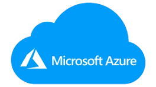

<h2>Virtual Machine Setup</h2>

In this lab we will create a small cloud environment using Microsoft Azure. The goal is to build two virtual machines that will allow us to generate and analyze network traffic. One machine will run Windows and will be used to install Wireshark so we can capture and analyze packets. The second machine will run Linux and will be used to generate traffic across the network.

By the end of this section, we will have a Windows virtual machine and a Linux virtual machine running inside the same virtual network so they can communicate with each other. This communication is what allows Wireshark to capture and analyze network activity during the later parts of the lab.

 

<h3>Prerequisites</h3>

Before starting this lab, you will need access to Microsoft Azure. Microsoft Azure is a cloud computing platform that allows users to create and manage virtual machines, networks, and other computing resources through an online portal.

In this lab, Azure will be used to create our virtual machines instead of running them on our personal computer. This allows us to simulate a real network environment inside the cloud.

If you do not already have an Azure account, you can create a free account using the link below. Microsoft provides free credits when you first sign up, which are more than enough for this lab.

Create a free Azure account here: 
https://azure.microsoft.com/en-us/free/

 

<h3>Creating the Windows Virtual Machine</h3>

The first step in setting up our lab environment is creating a <b>Resource Group</b>. A Resource Group in Azure is essentially a container that holds all of the resources for a project. This helps keep everything organized and allows you to manage multiple resources together.

For example, our resource group will contain the virtual machines, networking components, and other resources used throughout this lab. Keeping everything in one group makes it easier to manage and delete the environment later when the lab is finished.

 

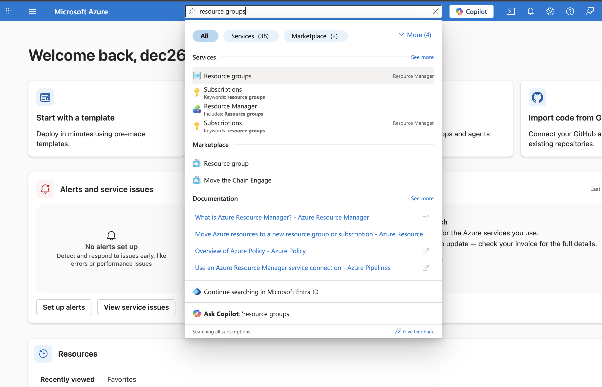

From the Azure portal homepage, use the search bar at the top of the page and type <b>resource groups</b>. Azure will display several results related to resource management. Select <b>Resource groups</b> from the services list to open the resource group management page.

 

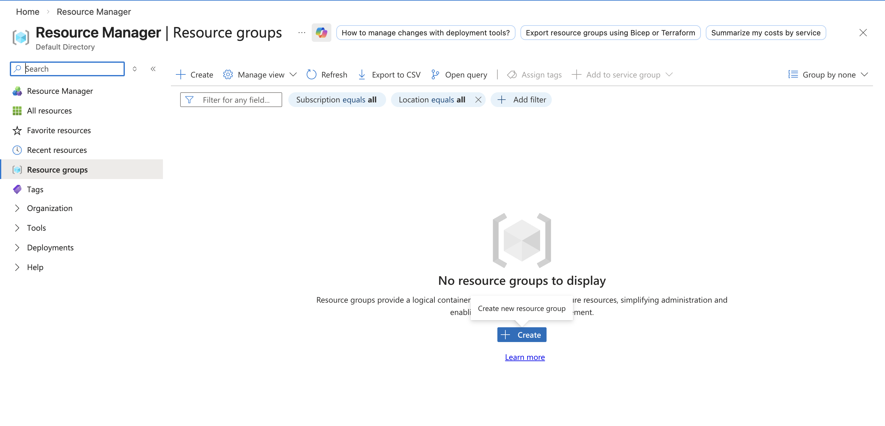

Once the Resource Groups page opens, you will see a list of any existing resource groups associated with your account. Since this environment is new, there may be no resource groups displayed yet. Click the <b>Create</b> button to begin creating a new resource group for this lab.

 

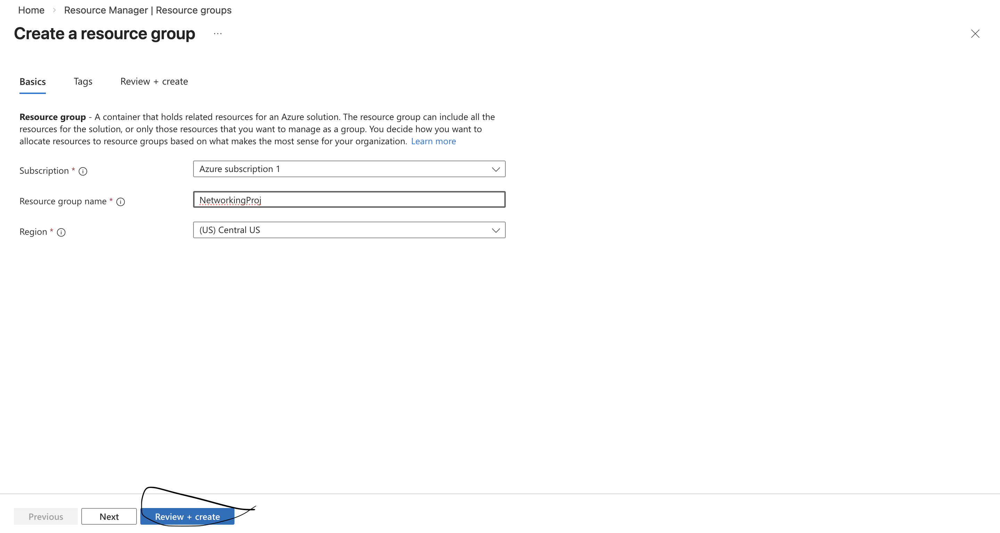

You will now be asked to configure the resource group settings. First, choose your Azure subscription. Next, enter a name for the resource group. In this lab, the resource group is named <b>NetworkingProj</b>. This name can be anything you choose, but it is good practice to choose a name that describes the project.

You will also choose a <b>Region</b>. The region determines which Azure data center your resources will run in. In this example, the region selected is <b>Central US</b>.

 

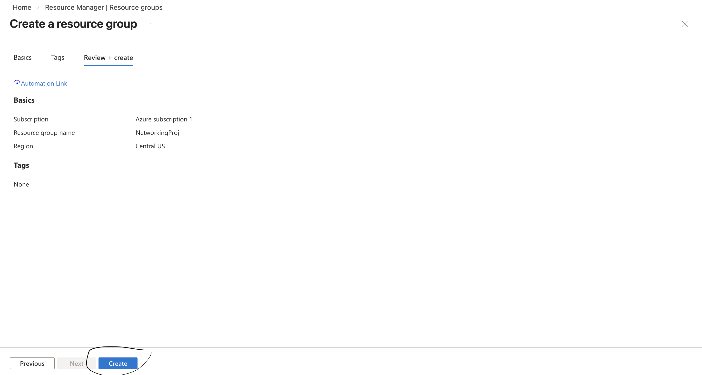

After filling out the required fields, click <b>Review + create</b>. Azure will check the configuration to make sure everything is set up correctly before deploying the resource group.

 

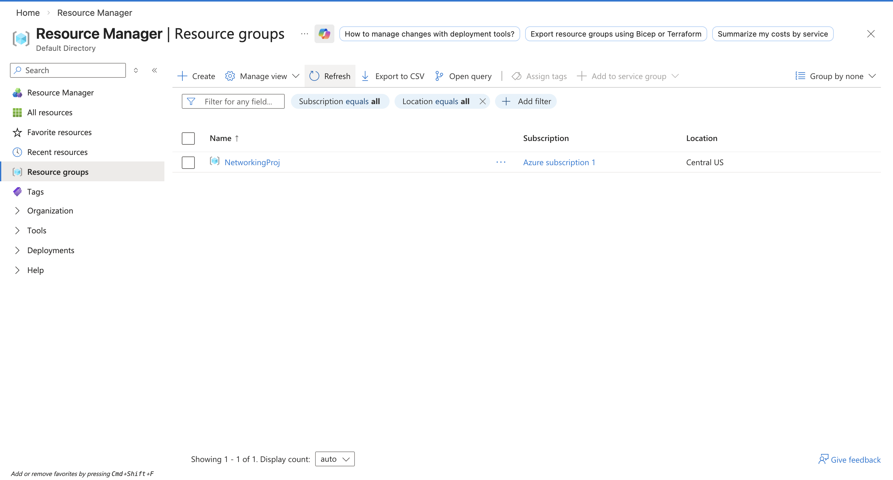

If the validation is successful, click the <b>Create</b> button. Azure will now begin deploying the resource group. This process typically only takes a few seconds.

 

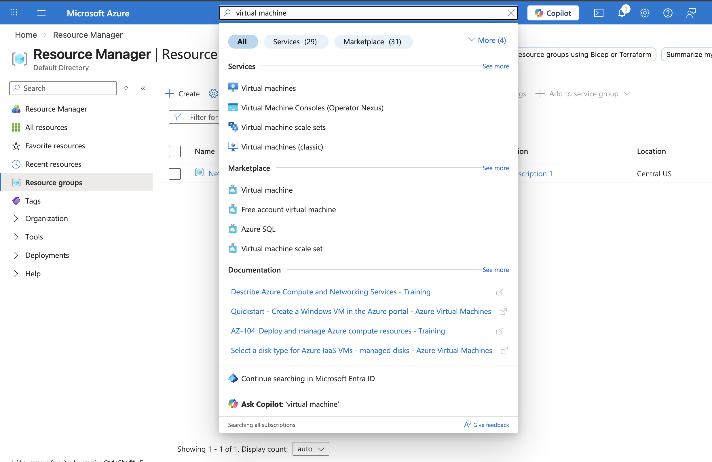

Once the resource group has been created, it will appear in the list of resource groups. This confirms that the container for our lab environment has been successfully created. All virtual machines and networking components used in this lab will now be placed inside this resource group.

 

Now that the resource group has been created, the next step will be creating the Windows virtual machine that will be used to connect via Remote Desktop and install Wireshark for packet analysis.

 

<h3>Creating the Windows Virtual Machine</h3>

Now that the resource group has been created, the next step is to create the Windows virtual machine that will be used to analyze network traffic using Wireshark. This machine will act as our primary workstation during the lab.

A <b>virtual machine (VM)</b> is essentially a computer that runs inside another computer. In this case, the virtual machine will run inside Microsoft's Azure cloud infrastructure instead of on our personal device. This allows us to simulate a real-world network environment.

 

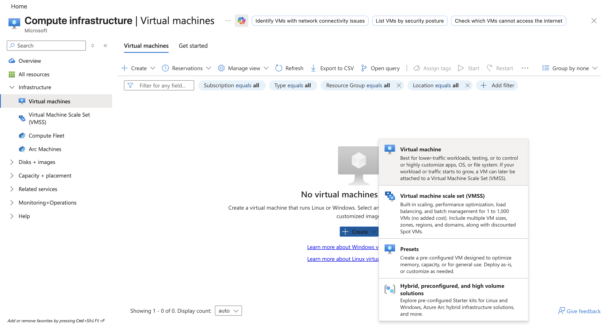

From the Azure portal, navigate to the <b>Virtual machines</b> section. This page allows you to create and manage virtual machines within your Azure environment.

Click the <b>Create</b> button and then select <b>Virtual machine</b> from the dropdown menu to begin creating a new VM.

 

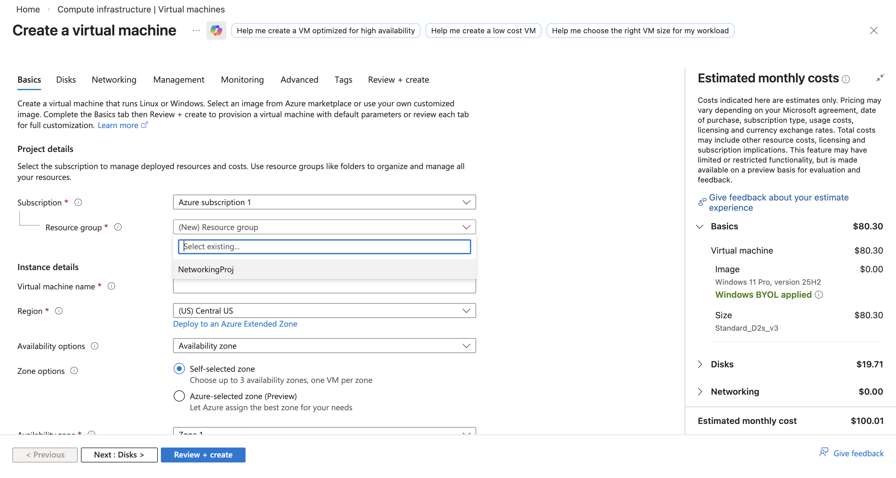

You will now be taken to the <b>Create a virtual machine</b> configuration page. Under the <b>Project details</b> section, select your Azure subscription and choose the resource group that was created earlier in the lab.

In this example, the resource group named <b>NetworkingProj</b> is selected. This ensures that the virtual machine will be organized within the same project container as the rest of our lab resources.

 

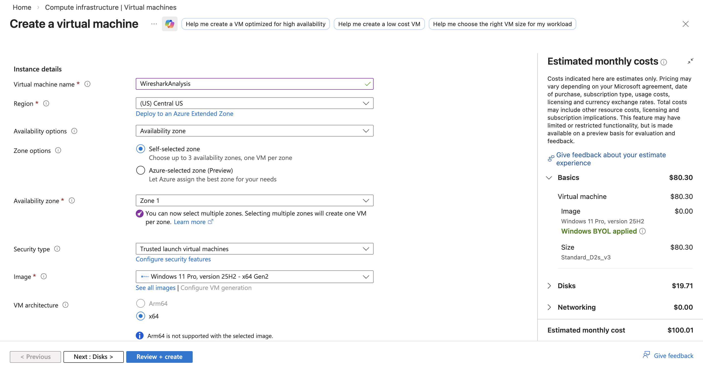

Next, configure the <b>Instance details</b> for the virtual machine. This includes giving the machine a name and selecting the region where it will run.

In this lab, the virtual machine is named <b>WiresharkAnalysis</b>. The region is set to <b>(US) Central US</b>, which matches the region used when creating the resource group earlier.

For the image, select <b>Windows 11 Pro</b>. This operating system will allow us to install Wireshark and use Remote Desktop Protocol (RDP) to access the machine from our personal computer.

 

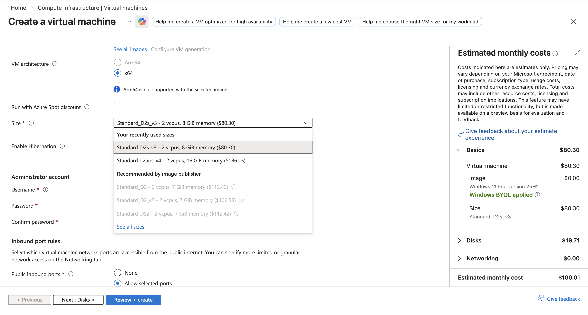

Next, choose the <b>virtual machine size</b>. The VM size determines the amount of CPU power and memory allocated to the virtual machine.

For this lab, the size <b>Standard_D2s_v3</b> is selected. This configuration provides 2 virtual CPUs and 8 GB of memory, which is more than enough for running Wireshark and performing network analysis during the lab exercises.

 

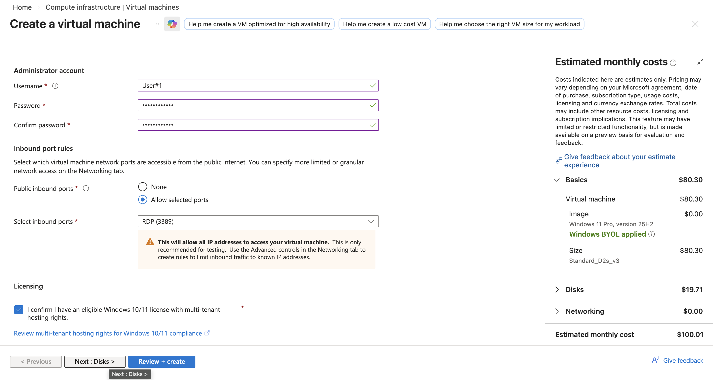

Under the <b>Administrator account</b> section, create a username and password for the virtual machine. These credentials will be used later when connecting to the machine using Remote Desktop Protocol (RDP).

Make sure to choose a strong password that meets Azure's security requirements. You will need these login credentials when accessing the Windows virtual machine.

In the <b>Inbound port rules</b> section, select <b>Allow selected ports</b> and ensure that <b>RDP (3389)</b> is enabled. This allows us to remotely connect to the virtual machine from our computer using Remote Desktop.

 

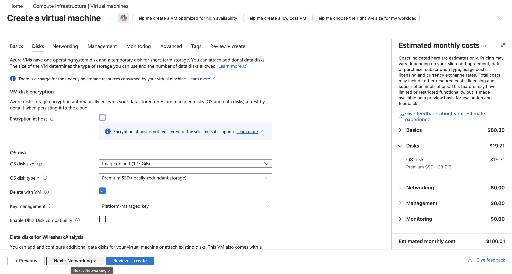

Next, navigate to the <b>Disks</b> tab. The disk configuration determines how the virtual machine stores its operating system and files.

For this lab, the default configuration is sufficient. The operating system disk will be stored on a <b>Premium SSD</b>, which provides fast storage performance for the virtual machine.

After reviewing the disk configuration, click <b>Next: Networking</b> to continue configuring the virtual machine.

 

<h3>Configuring Virtual Network Settings</h3>

Next, navigate to the <b>Networking</b> tab. Networking settings determine how the virtual machine communicates with other machines and networks.

In cloud environments like Azure, machines communicate through something called a <b>Virtual Network (VNet)</b>. A Virtual Network works similarly to a home or office network, allowing devices connected to it to communicate with each other securely.

For this lab to function correctly, both the Windows virtual machine and the Linux virtual machine must be placed inside the <b>same Virtual Network</b>. This ensures they can communicate with each other so that Wireshark can capture traffic between the machines.

 

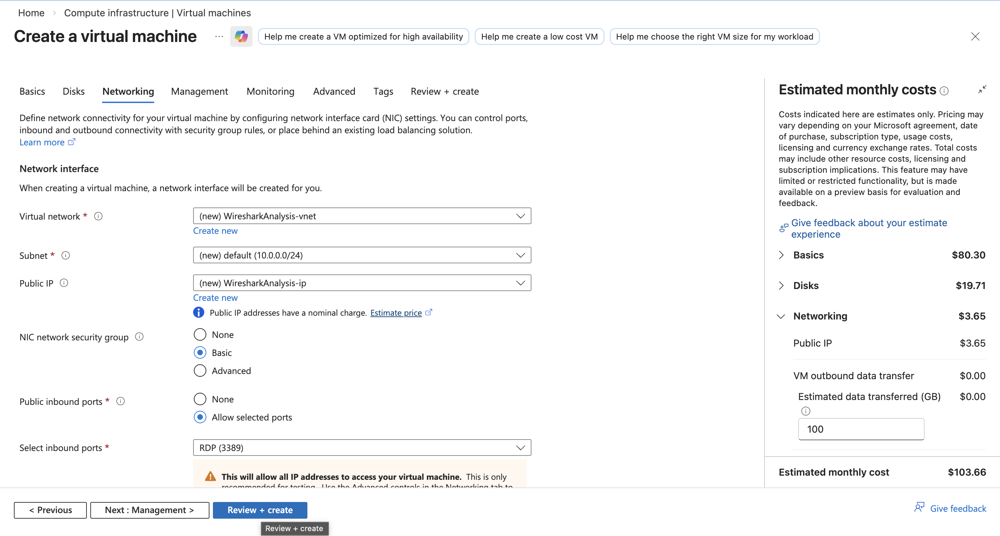

Under the <b>Virtual network</b> setting, Azure automatically creates a new virtual network named <b>WiresharkAnalysis-vnet</b>. The subnet is configured as <b>10.0.0.0/24</b>, which defines the range of IP addresses available to devices inside this network.

The VM is also assigned a <b>Public IP address</b>, which allows us to connect to the virtual machine from outside the Azure environment using Remote Desktop.

Ensure that <b>Allow selected ports</b> is enabled and that <b>RDP (3389)</b> is selected. This allows remote connections to the Windows virtual machine.

 

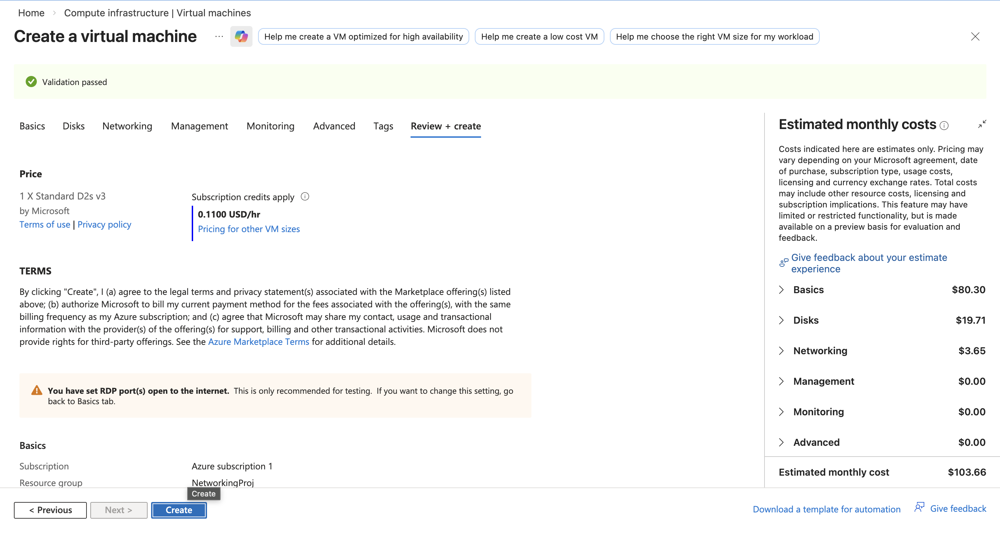

After finishing the configuration settings, click the <b>Review + create</b> button. Azure will validate the virtual machine configuration to ensure that all required settings have been completed properly.

 

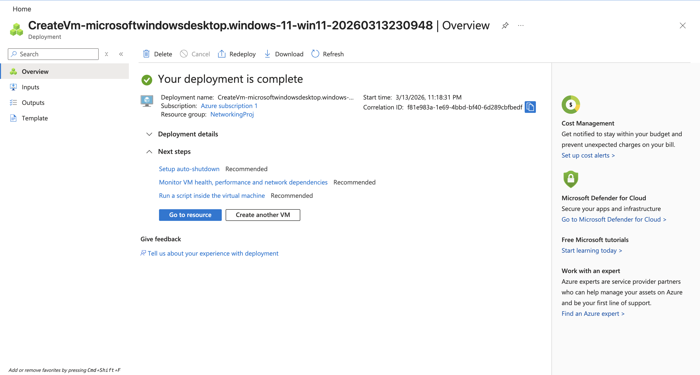

If the validation process passes successfully, Azure will display a confirmation message. Click the <b>Create</b> button to begin deploying the virtual machine.

Azure will now begin provisioning the Windows virtual machine and its associated resources, including the network interface, disk storage, and public IP address.

 

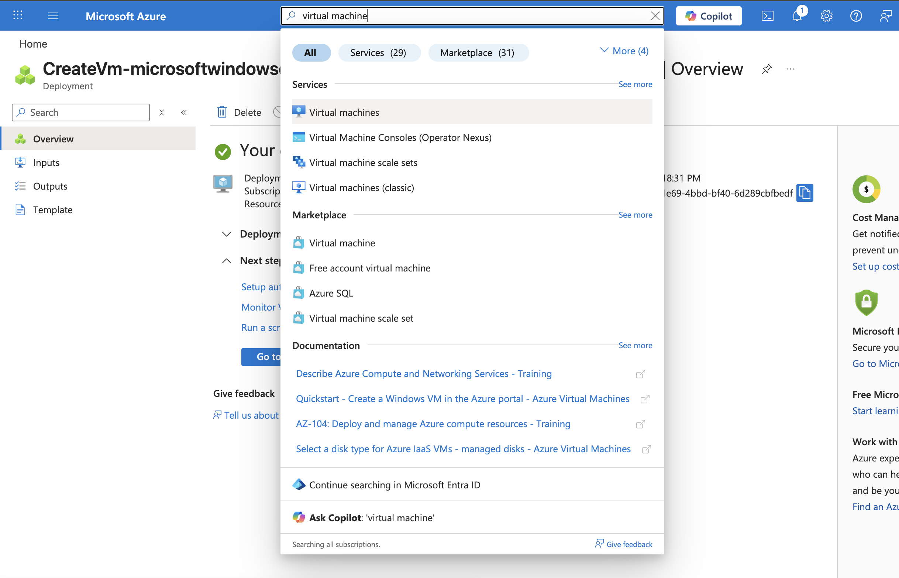

Once the deployment process is finished, Azure will display a message confirming that <b>Your deployment is complete</b>. This indicates that the Windows virtual machine has been successfully created.

At this point, the Windows VM is fully operational and ready to be used for the Wireshark packet analysis portion of this lab.

 

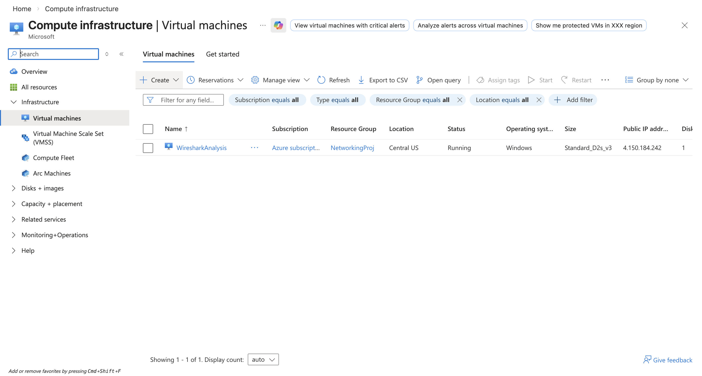

To verify that the virtual machine has been successfully deployed, return to the Azure search bar and type <b>virtual machines</b>. Select the <b>Virtual machines</b> service from the search results.

 

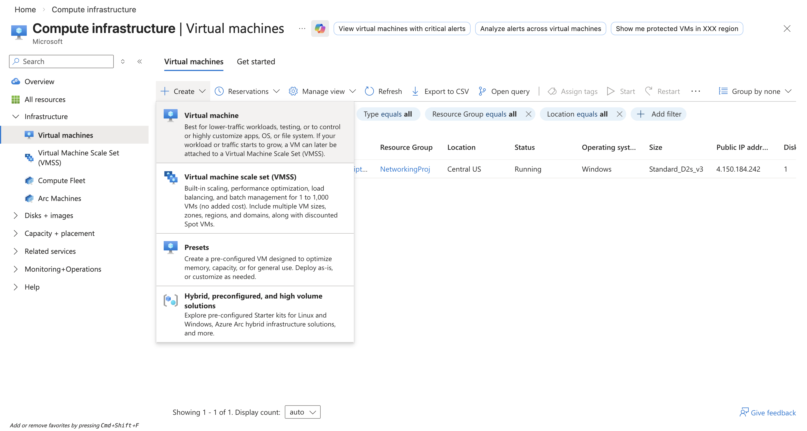

You should now see the newly created virtual machine listed. The VM named <b>WiresharkAnalysis</b> should appear with a status of <b>Running</b>, indicating that the machine is active and ready for use.

 

<h3>Creating the Linux Virtual Machine</h3>

Next, we will create a second virtual machine that runs Linux. This machine will be used to generate network traffic that we can capture and analyze using Wireshark on the Windows machine.

Using two machines allows us to simulate real network communication between systems, which is necessary when analyzing protocols such as DHCP, DNS, ICMP, SSH, and RDP.

 

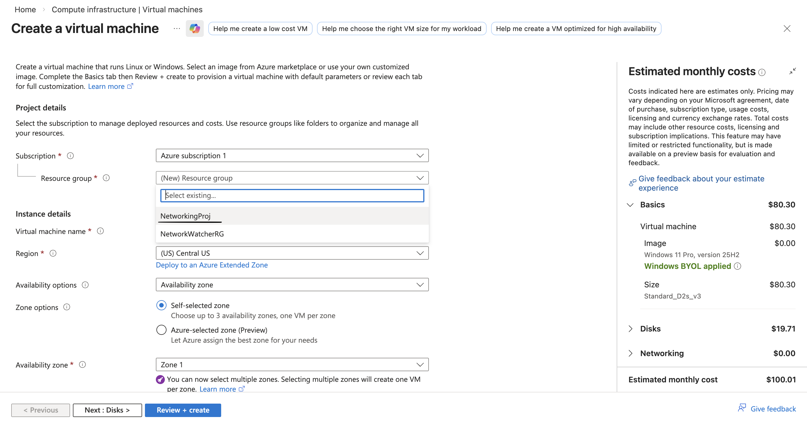

From the Virtual Machines page, click the <b>Create</b> button again and select <b>Virtual machine</b>. This will begin the process of creating the Linux virtual machine.

 

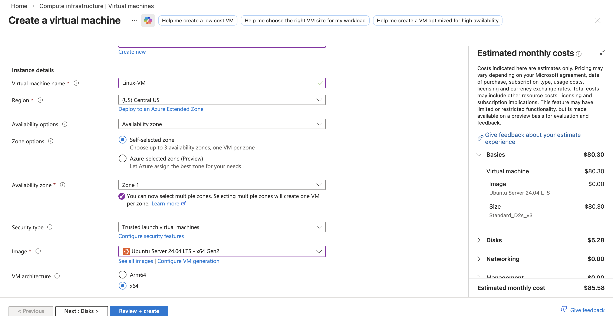

In the configuration page, select the same <b>Resource Group</b> used earlier in the lab. This keeps both virtual machines organized under the same project.

Give the machine a name such as <b>Linux-VM</b> and select the same <b>Central US</b> region that was used when creating the Windows virtual machine.

For the operating system image, choose <b>Ubuntu Server 24.04 LTS</b>. Ubuntu is a widely used Linux distribution and works well for generating network traffic and performing command-line network testing.

Most importantly, ensure that this Linux VM is connected to the <b>same Virtual Network</b> that was created earlier. This allows the Windows VM and Linux VM to communicate with each other inside the Azure environment.

 

<h3>Configuring Administrator Credentials for the Linux Virtual Machine</h3>

When creating the Linux virtual machine, we must configure administrator credentials. These credentials allow us to securely access and manage the system once it has been deployed.

Azure allows two authentication methods for Linux machines: <b>SSH Public Key</b> authentication or <b>Password</b> authentication. For this lab, we will use <b>Password authentication</b> because it is simpler for beginners and easier to demonstrate.

Enter a username and password that will be used to log into the Linux system.

 

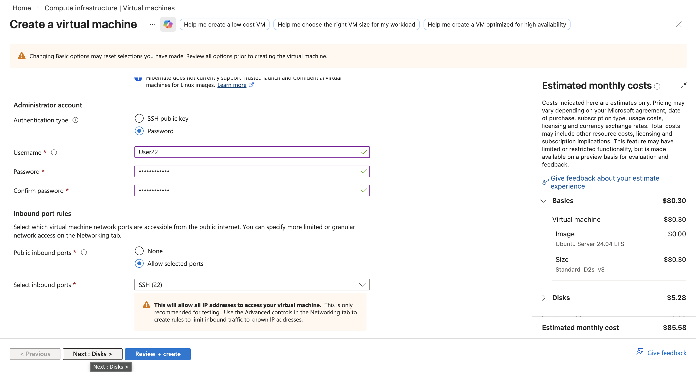

Under <b>Inbound port rules</b>, ensure that <b>Allow selected ports</b> is chosen and that <b>SSH (22)</b> is selected. SSH is the protocol used to securely connect to Linux systems remotely.

Allowing SSH access will let us log into the Linux virtual machine later to generate network traffic that Wireshark can capture and analyze.

---

<h3>Configuring Virtual Machine Disk Settings</h3>

Next, move to the <b>Disks</b> tab. This section defines the storage configuration for the virtual machine.

Every virtual machine requires an operating system disk where the system files and installed software will be stored.

 

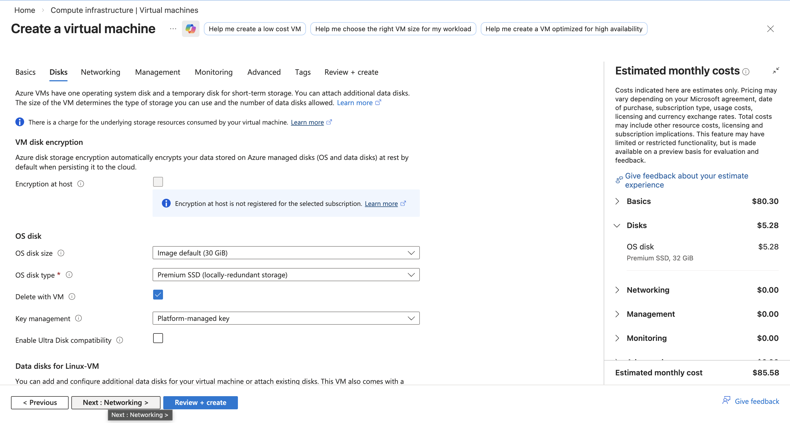

The default configuration uses a <b>Premium SSD</b> disk with approximately <b>30 GiB</b> of storage. This is more than sufficient for the purposes of this networking lab.

Since we do not need additional storage for this exercise, the default disk configuration can remain unchanged.

---

<h3>Configuring Networking for the Linux Virtual Machine</h3>

Next, navigate to the <b>Networking</b> tab. This is one of the most important sections for this lab.

Remember that both the Windows and Linux virtual machines must be placed inside the <b>same Virtual Network (VNet)</b>. This allows the machines to communicate with each other internally inside Azure.

Without being on the same virtual network, the machines would not be able to send traffic to each other, and Wireshark would not be able to capture the network packets that we will analyze later.

 

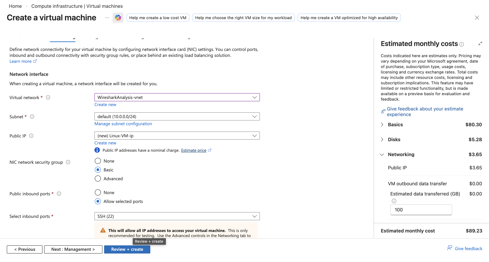

Ensure that the selected virtual network is <b>WiresharkAnalysis-vnet</b>, which was created earlier when deploying the Windows virtual machine.

The Linux VM should also be assigned a <b>Public IP address</b>. This allows us to connect to the machine using SSH from outside the Azure environment.

Under <b>Inbound ports</b>, make sure <b>SSH (22)</b> is enabled so that remote SSH connections can be established.

---

<h3>Reviewing and Creating the Linux Virtual Machine</h3>

After completing all configuration steps, select the <b>Review + create</b> tab. Azure will automatically validate the configuration settings to ensure everything has been configured correctly.

 

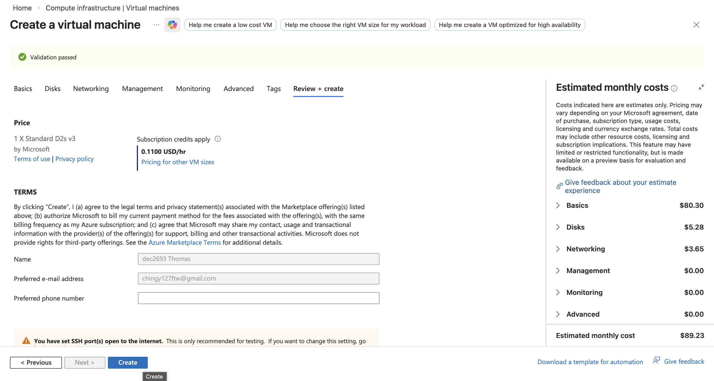

If the validation passes successfully, Azure will display a confirmation message. At this point, click the <b>Create</b> button to begin deploying the Linux virtual machine.

Azure will now begin provisioning the Linux system along with its associated resources such as the disk, network interface, and public IP address.

---

<h3>Linux Virtual Machine Deployment</h3>

After clicking create, Azure begins the deployment process. During this time Azure allocates resources, configures networking, installs the operating system image, and prepares the machine for use.

 

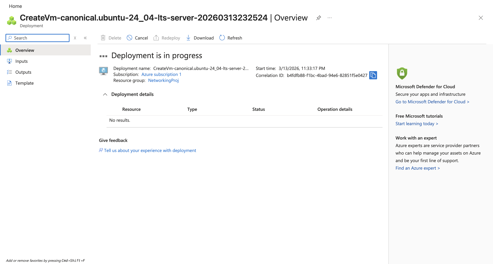

This process typically takes a few minutes to complete depending on resource availability in the selected region.

---

<h3>Deployment Completion</h3>

Once the deployment finishes, Azure will display a message confirming that the deployment has completed successfully.

 

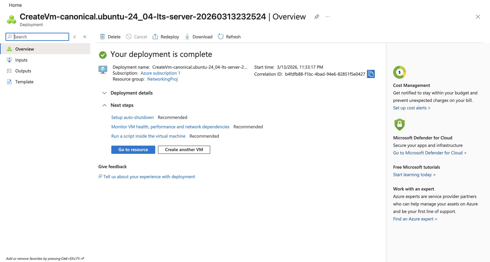

At this point, the Linux virtual machine is fully operational inside the Azure cloud environment.

---

<h3>Verifying Both Virtual Machines</h3>

To verify that both machines were created successfully, return to the Azure search bar and type <b>VM</b>. Select the <b>Virtual machines</b> service from the search results.

 

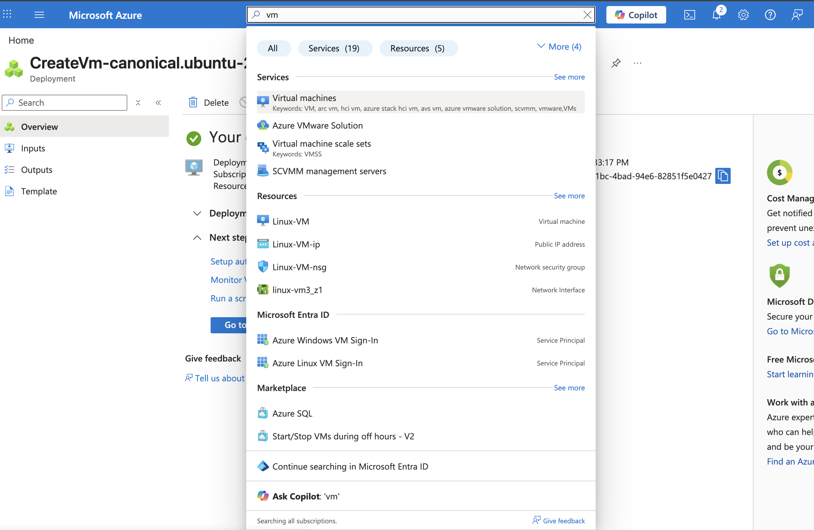

This will open the Virtual Machines dashboard where all deployed machines can be viewed and managed.

 

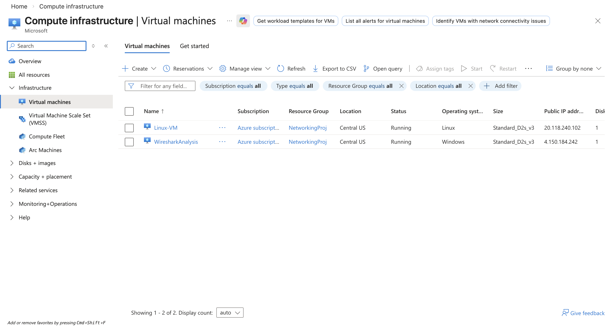

You should now see both virtual machines listed and running:

<ul>
<li><b>WiresharkAnalysis</b> – Windows virtual machine</li>
<li><b>Linux-VM</b> – Ubuntu Linux virtual machine</li>
</ul>

Both machines are located in the same <b>Resource Group</b> and are connected to the same <b>Virtual Network</b>, which allows them to communicate with each other across the network.

This network communication will allow us to generate and analyze traffic using Wireshark in the next section of the lab.

---

<h2>End of Part 1</h2>

At this stage, we have successfully built a cloud-based networking lab environment using Microsoft Azure.

In <b>Part 2</b>, we will:

<ul>
<li>Connect to the Windows virtual machine using <b>Remote Desktop Protocol (RDP)</b></li>
<li>Install <b>Wireshark</b></li>
<li>Begin capturing and analyzing real network traffic</li>
</ul>

This environment will be used in later sections to analyze protocols including:

<ul>
<li>DHCP</li>
<li>DNS</li>
<li>ICMP</li>
<li>SSH</li>
<li>RDP</li>
</ul>

